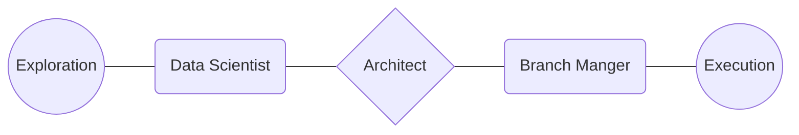
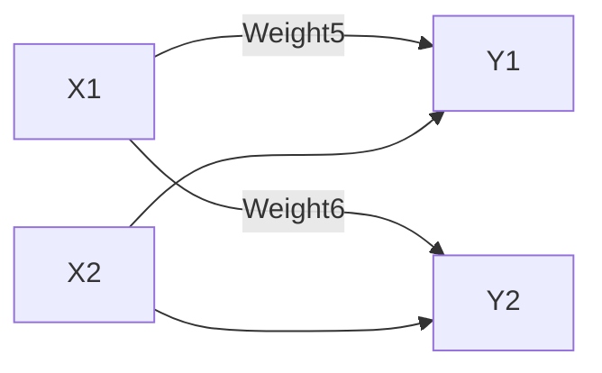

# Natural-Language-Processing
Compilation of notes and study material related to Natural Language Processing by Avinash Nalwani

- Skill > Degree
- Non-elite is secondary
- CTC (Cost to Company)
- Quora, the place to share experiences
- Online presence is necessary
    - LinkedIN, Naukri, Angelist, Freelancing websites
    - Articles on Medium, Youtube and your own blog
- Job
- Struggle is Real
- USP Project - Kabbadi Analytics, Computer Vision model of Accident Prediction
- Create Final Year Project Now
- Interview Cracking Techniques

# Data Science

| Data Scientist | Data Analyst | Data Engineer (ELT,ETL) | Business Analyst | NLP Engineer | ML Engineer | Statistician |
| --- | --- | --- | --- | --- | --- | --- |
| Python | SQL | Python | In IT People who manage Trello, Assana, JIRA (Client to Developer bridge) what to build | Data Scientist + NLP | Software Engineer who knows ML  | Stats (Nupek company in Ahembabad works on SAS which is a paid version of statistic tool like R. |
| Machine Learning | Stats | SQL | In Financial Analyst (Stock Companies) | Statistician |  |  |
| Statistician | Power BI | Data Warehouse (Snowflake, DBT, Informatory) | SQL | Pharmastats (Ahemdabad Firm) (IGNOU PG Diploma - Gyankosh (Biostatistics Course) |  |  |
| Natural Language Processing | Tableau | Airflow | Power BI | OCR comes here |  |  |
| Deep Learning | Looker | Hadoop, Spark, Hive | Reporting | Health Insurance company submit claim insurance form |  |  |
| Computer Vision | Data Studio | Kafka | Market Research (Statistics) - Market Survey, Customer Churn |  |  |  |
| SQL | Qlikview |  |  |  |  |  |
| Cloud (Azure, AWS) |  |  |  |  |  |  |
| Quality Control, Chemical quality |  |  |  |  |  |  |

Sports Analytics - 7771920564

---

# Lecture 14/09/2022

## Discussed till now

- Skill vs Degree
    - Skill is very necessary but degree is necessary for entry.
- Non elite institutions
    - Skill is paramount
- Government vs Private Jobs
    - Competition is very high
    - Data Science - Government Jobs
    - Go for lateral entry in these sectors like SBI, including Insurance Companies like LIC, PSU
    - Salary will often get reduced, jobs security ni chiye
- Skills
    - Scala (rare skill)
    - 6 months in certain field makes you perfect
    - Animation may take 1 year
    - Cloud only one in AWS, GCP, Azure
    - Balance the pros and cons of any decision
- Online presence is necessity (Naukri.com, Indeed, Instagram, Linkedin, Angelist)
    - It will develop a sense of what’s needed or expected of u
    - Pick Tier 2 and Tier 3 cities, make list you will get more exposure
    - Write article on Medium - Blogging, make Youtube videos
    - PoC (Proof of Concept), make projects
    - See the profile of people with similar experience
- Job Types
    - Data Scientist
    - Data Engineer
    - Data Analyst
    - Statistician
    - ML Engineer (Data Scientist can’t deploy model, this is a software engineer who knows ML)
    - NLP Engineer
    - Business Analyst: IT, Stock Firms (which shares you should buy, what thing you should invest like Crypto stuff)

# Natural Language Processing

1. Introduction to Natural 

[https://machinelearninggeek.com/nlp](https://machinelearninggeek.com/nlp)

[https://machinelearninggeek.com/data-science-interview-questions-part-6-nlp-text-mining/](https://machinelearninggeek.com/data-science-interview-questions-part-6-nlp-text-mining/)

Entity Detection

How machine learning automation can reduce cost?

Some jobs will come some will go

How to reduce the client cost.

[https://www.onlineocr.net/](https://www.onlineocr.net/)

- Understand Roadmap

Books

-
